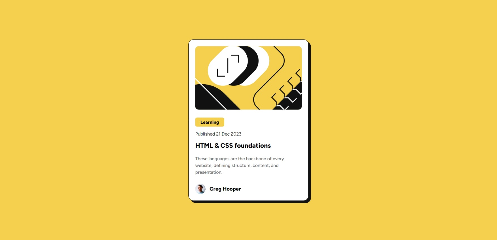

# Frontend Mentor - Blog preview card solution

This is a solution to the [Blog preview card challenge on Frontend Mentor](https://www.frontendmentor.io/challenges/blog-preview-card-ckPaj01IcS). Frontend Mentor challenges help you improve your coding skills by building realistic projects. 

## Table of contents

- [Overview](#overview)
  - [The challenge](#the-challenge)
  - [Screenshot](#screenshot)
  - [Links](#links)
- [My process](#my-process)
  - [Built with](#built-with)

## Overview

### The challenge

Users should be able to:

- See hover and focus states for all interactive elements on the page

### Screenshot

### Links

- Solution URL: [Click here](https://github.com/yacineragueb/Frontend-challenge/tree/master/blog-preview-card-main)
- Live Site URL: [Click here](https://blog-preview-card-challenge-ashy.vercel.app/)

## My process

### Built with

- Semantic HTML5 markup
- CSS custom properties
- Flexbox
- CSS Grid
- Mobile-first workflow
- [Tailwind css](https://tailwindcss.com/) - Framework css

## Author

- Website - [Yacine Ragueb](https://yacineragueb.vercel.app/)
- Frontend Mentor - [@yacineragueb](https://www.frontendmentor.io/profile/yacineragueb)
- LinkedIn - [@yacineRagueb](https://www.linkedin.com/in/yacineragueb/)
