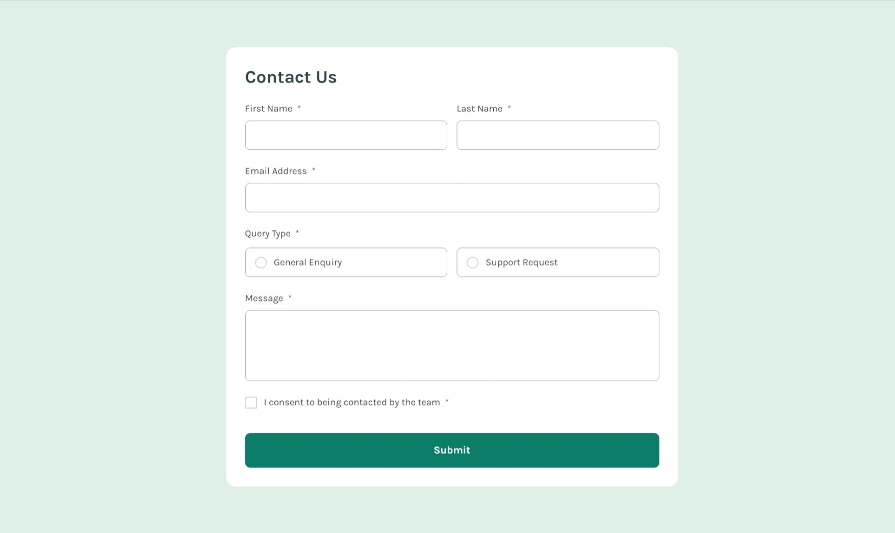

# Frontend Mentor - Contact form solution

This is a solution to the [Contact form challenge on Frontend Mentor](https://www.frontendmentor.io/challenges/contact-form--G-hYlqKJj). Frontend Mentor challenges help you improve your coding skills by building realistic projects. 

## Table of contents

- [Overview](#overview)
  - [The challenge](#the-challenge)
  - [Screenshot](#screenshot)
  - [Links](#links)
- [My process](#my-process)
  - [Built with](#built-with)
  - [What I learned](#what-i-learned)
- [Author](#author)

## Overview

### The challenge

Users should be able to:

- Complete the form and see a success toast message upon successful submission
- Receive form validation messages if:
  - A required field has been missed
  - The email address is not formatted correctly
- Complete the form only using their keyboard
- Have inputs, error messages, and the success message announced on their screen reader
- View the optimal layout for the interface depending on their device's screen size
- See hover and focus states for all interactive elements on the page

### Screenshot

### Links

- Solution URL: [Click Here](https://github.com/Yaciine19/Frontend-challenge/tree/master/contact-form-main)
- Live Site URL: [Click Here](https://contact-form-challenge-ten.vercel.app/)

## My process

### Built with

- Semantic HTML5 markup
- CSS custom properties
- Flexbox
- CSS Grid
- Mobile-first workflow
- [React](https://reactjs.org/) - JS library
- [Tailwind](https://tailwindcss.com/) - framework css
- [Framer Motion](https://motion.dev/) - For animation
- [Zod](https://zod.dev/) - Data validation

### What I learned

This challenge was really useful; I learned a lot from it, such as the Zod library and the screen reader. I would be happy if you could check out my code, test it, and leave your feedback.

## Author

- Website - [Yacine Ragueb](https://yacineragueb.vercel.app/)
- Frontend Mentor - [@Yaciine19](https://www.frontendmentor.io/profile/Yaciine19)
- LinkedIn - [@yacineRagueb](https://www.linkedin.com/in/yacine-ragueb-8033a9302/)
