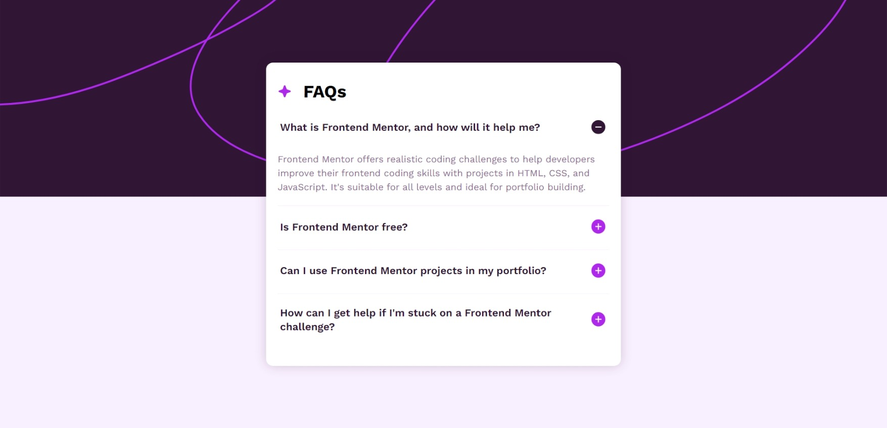

# Frontend Mentor - FAQ accordion solution

This is a solution to the [FAQ accordion challenge on Frontend Mentor](https://www.frontendmentor.io/challenges/faq-accordion-wyfFdeBwBz). Frontend Mentor challenges help you improve your coding skills by building realistic projects. 

## Table of contents

- [Overview](#overview)
  - [The challenge](#the-challenge)
  - [Screenshot](#screenshot)
  - [Links](#links)
- [My process](#my-process)
  - [Built with](#built-with)
  - [What I learned](#what-i-learned)
  - [Continued development](#continued-development)
- [Author](#author)

## Overview

### The challenge

Users should be able to:

- Hide/Show the answer to a question when the question is clicked
- Navigate the questions and hide/show answers using keyboard navigation alone
- View the optimal layout for the interface depending on their device's screen size
- See hover and focus states for all interactive elements on the page

### Screenshot

### Links

- Solution URL: [Click Here](https://github.com/yacineragueb/Frontend-challenge/tree/master/faq-accordion-main)
- Live Site URL: [Click Here](https://faq-accordion-challenge-lemon.vercel.app/)

## My process

### Built with

- Semantic HTML5 markup
- CSS custom properties
- Flexbox
- CSS Grid
- Mobile-first workflow
- [React](https://reactjs.org/) - JS library
- [Tailwind](https://tailwindcss.com/) - framework css
- [Framer Motion](https://motion.dev/) - for animation

### What I learned

This challenge was really amazing! Although it took me some time, I learned new things from it. I explored the **Framer Motion** library and how it works, in addition to discovering a new fact about navigation using the **Tab** key. I didn't expect it to be this easy—basically, you just add the **`tabIndex`** attribute to the element you want to navigate to.  

However, the downside was that moving forward and backward between questions was only possible using the **Tab** key, which I found time-consuming. So, I came up with another solution: I added an alternative navigation method using the **Up** and **Down** arrow keys to make the process smoother.  

It was really fun! You can check out the code and see for yourself. 🚀

### Continued development

In this challenge, I used React, Tailwind, and the Framer Motion library to enhance my skills, showcase them, and take them to a higher level. 👌

## Author

- Website - [Yacine Ragueb](https://yacineragueb.vercel.app/)
- Frontend Mentor - [@yacineragueb](https://www.frontendmentor.io/profile/yacineragueb)
- LinkedIn - [@yacineRagueb](https://www.linkedin.com/in/yacineragueb/)
