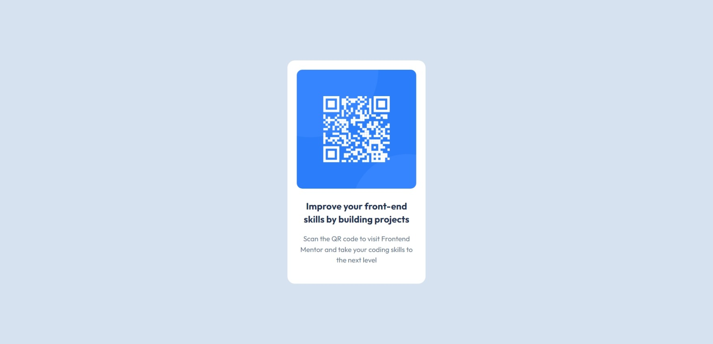

# Frontend Mentor - QR code component solution

This is a solution to the [QR code component challenge on Frontend Mentor](https://www.frontendmentor.io/challenges/qr-code-component-iux_sIO_H). Frontend Mentor challenges help you improve your coding skills by building realistic projects. 

## Table of contents

- [Overview](#overview)
  - [Screenshot](#screenshot)
  - [Links](#links)
- [My process](#my-process)
  - [Built with](#built-with)
  - [What I learned](#what-i-learned)
  - [Continued development](#continued-development)
- [Author](#author)

## Overview

### Screenshot

### Links

- Solution URL: [Click here](https://your-solution-url.com)
- Live Site URL: [Click here](https://your-live-site-url.com)

## My process

### Built with

- Semantic HTML5 markup
- CSS custom properties
- Flexbox
- CSS Grid
- Mobile-first workflow
- [Tailwind](https://tailwindcss.com/) - Framework css

### What I learned

Yeah, it was fun to do this challenge!

### Continued development

Expanding my expertise in Tailwind CSS to create more efficient and responsive designs

## Author

- Website - [Yacine Ragueb](https://yacineragueb.vercel.app/)
- Frontend Mentor - [@Yaciine19](https://www.frontendmentor.io/profile/Yaciine19)
- LinkedIn - [@yacineRagueb](https://www.linkedin.com/in/yacine-ragueb-8033a9302/)
