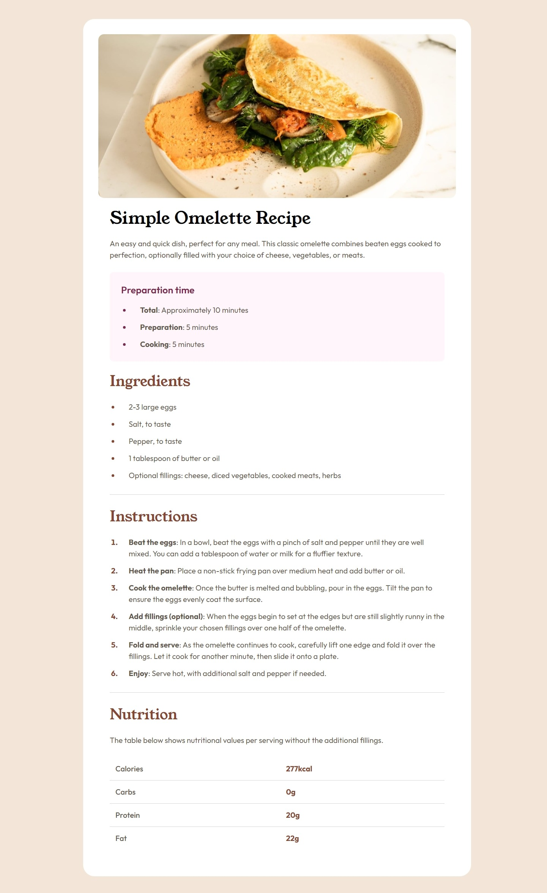

# Frontend Mentor - Recipe page solution

This is a solution to the [Recipe page challenge on Frontend Mentor](https://www.frontendmentor.io/challenges/recipe-page-KiTsR8QQKm). Frontend Mentor challenges help you improve your coding skills by building realistic projects. 

## Table of contents

- [Overview](#overview)
  - [The challenge](#the-challenge)
  - [Screenshot](#screenshot)
  - [Links](#links)
- [My process](#my-process)
  - [Built with](#built-with)
  - [What I learned](#what-i-learned)
  - [Continued development](#continued-development)
- [Author](#author)

## Overview

### Screenshot

### Links

- Solution URL: [Click here](https://github.com/yacineragueb/Frontend-challenge/tree/master/recipe-page-main)
- Live Site URL: [Click here](https://recipe-page-two-woad.vercel.app/)

## My process

### Built with

- Semantic HTML5 markup
- CSS custom properties
- Mobile-first workflow
- [Tailwind](https://tailwindcss.com/) - Framework CSS

### What I learned

It was a good and easy training to learn, reinforce, and apply Tailwind more effectively.

### Continued development

I want to improve my Tailwind skills further to create more modern projects.

## Author

- Website - [Yacine Ragueb](https://yacineragueb.vercel.app/)
- Frontend Mentor - [@yacineragueb](https://www.frontendmentor.io/profile/yacineragueb)
- LinkedIn - [@yacineRagueb](https://www.linkedin.com/in/yacineragueb/)
